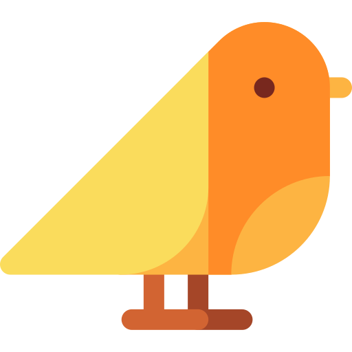

#  Birds - Detection

  

  <h3 align="center">Birds Realtime Detection using Deep Learning</h3>

  

    ตัวอย่างแอพที่ใช้ Platform Flutter ในการพัฒนา 
     
    และใช้ Tensorflow Lite ในการทำ Deep Learning 
     
  

## มีอะไรบ้างในแอปพลิเคชัน
  * แอปพลิเคชันสามารถจำแนกนกแต่ละชนิดได้ (Classification) มีขอบเขตคือนกสายพันธ์ไทยจำนวน 10 ชนิด
    * นกสาลิกาเขียว (Green Javan Magpie)
    * นกขมิ้น (Canary)
    * นกหัวโต (Plover)
    * นกกะดง (Nicobar dove)
    * นกยูง (Peacock)
    * นกกะรางหัวขวาน (Hoopoes)
    * นกอีก๋อย(Whimbrel)
    * นกกะทุง (Pelican)
    * นกแขกเต้า (Alexandrine parakeet)
    * นกแสก (Barn Owl)
  * แอปพลิเคชันสามารถจำแนกนกแต่ละชนิดได้แบบ Realtime

